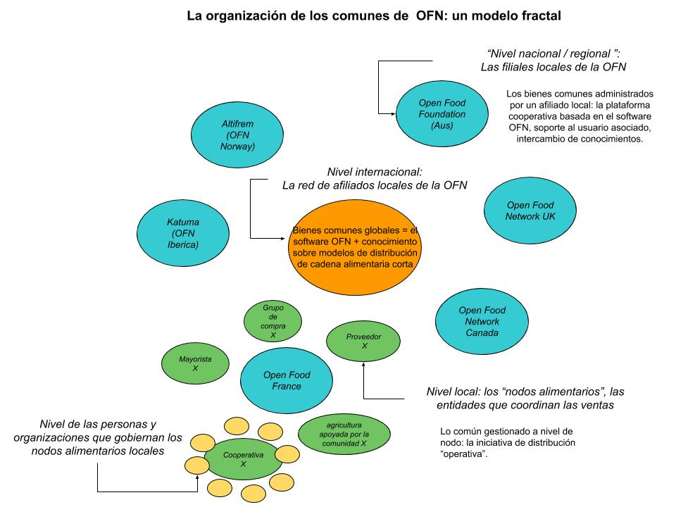

# Modelo Legal

## Tres capas de bienes comunes

No existe una entidad global legalmente constituída. Una operación siempre tiene su sede en un país determinado y se aplican las leyes de ese país. Además, Open Food Network tiene realmente tres "capas":

* la capa de bienes comunes globales: el software OFN y conocimiento compartido
* la capa territorial / regional / nacional: [OFN UK](https://openfoodnetwork.org.uk/), [OFN Australia](https://openfoodnetwork.org.au/), [Open Food France](https://openfoodfrance.org/), [Katuma](http://katuma.org/), [OFN Canada](https://openfoodnetwork.ca/), etc. son bienes comunes locales gestionados como plataformas cooperativas por múltiples partes interesadas. Esas organizaciones son usuarios y coproductores de los bienes comunes globales.
* la capa local: nodos de alimentos locales, que la mayoría de las veces también son guardianes de los bienes comunes locales y usuarios y coproductores de los bienes comunes locales: [OFN UK](https://openfoodnetwork.org.uk/), [OFN Australia](https://openfoodnetwork.org.au/), [Open Food France](https://openfoodfrance.org/), etc.

## Una red de entidades locales 

Entonces, legalmente hablando, Open Food Network es una red de entidades locales que están comprometidas y vinculadas entre sí para desarrollar y mantener los bienes comunes globales y, para empezar, el software OFN que todos usan. El documento contractual aquí es nuestro "[compromiso comunitario](https://community.openfoodnetwork.org/t/community-pledge-v2-january-2020/1847/2)". Toda entidad que quiera formar parte de la comunidad de Open Food Network tiene que firmar ese compromiso públicamente. Significa que todos compartimos la responsabilidad de ese bien común global, por lo que todos tenemos que trabajar para que prospere y sea económicamente viable, asegurándonos de que realmente sirva al sistema alimentario que queremos cuidar, etc.

## Una "licencia de marca" basada en el modelo de gobernanza de la entidad local 

Cada entidad local elige la estructura legal que mejor se adapta a sus necesidades, siguiendo el principio de subsidiariedad. PERO para poder proclamarse como "miembros de la Open Food Network", deben seguir las reglas explicadas en el compromiso de la comunidad, es decir:

* Deben ser administrados democráticamente. Como solo habrá una filial de la OFN en un territorio / región / condado determinado, debe estar abierto para que, si otras personas o partes interesadas están interesadas, puedan unirse y desarrollarse conjuntamente con ellos.
* Deben ser organizaciones sin fines de lucro. No significa que no deberían ganar dinero, significa que las ganancias no deberían ser un objetivo, solo un medio para lograr algún otro objetivo de cambio social.

